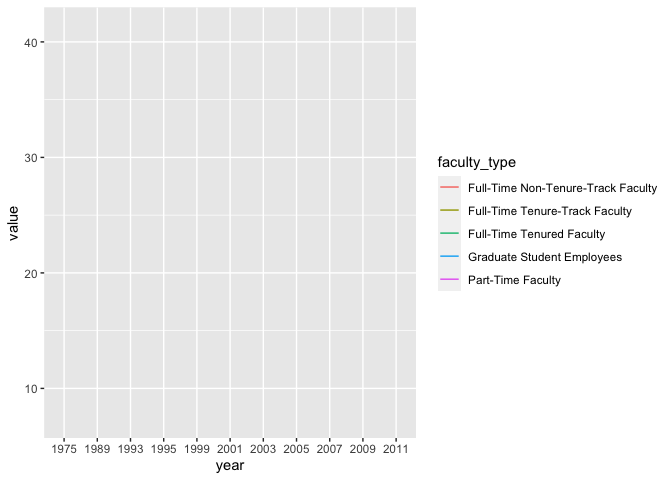
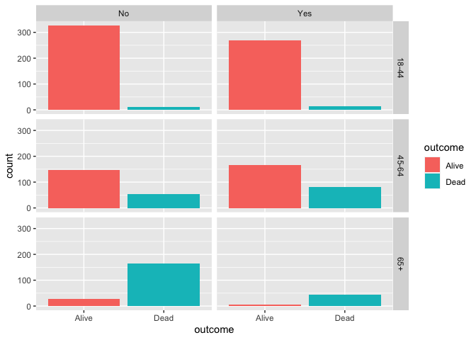
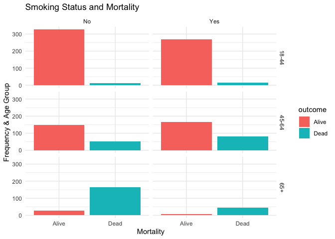

Lab 06 - Sad plots
================
Marcus Minko
02-16-2022

### Load packages and data

``` r
library(tidyverse) 
library(dsbox) 

staff <- read_csv("data/instructional-staff.csv")

staff_long <- staff %>%
  pivot_longer(cols = -faculty_type, names_to = "year") %>%
  mutate(value = as.numeric(value))
```

### Exercise 1

``` r
staff_long %>%
  ggplot(aes(x = year, y = value, color = faculty_type)) +
  geom_line()
```

    ## geom_path: Each group consists of only one observation. Do you need to adjust
    ## the group aesthetic?

<!-- -->

``` r
staff_long %>% 
ggplot(aes(x = year, y = value, color = faculty_type, group = faculty_type)) +
      labs(title = "proportion of faculty type", subtitle = "1975-2011", x = "by year", y = "percentage of faculty", color = "type of faculty group") +
     geom_line(size = 2) + theme_minimal()
```

<!-- --> ### Exercise 2

``` r
fisheries <- read_csv("data/fisheries.csv")
```

    ## Rows: 216 Columns: 4
    ## ── Column specification ────────────────────────────────────────────────────────
    ## Delimiter: ","
    ## chr (1): country
    ## dbl (3): capture, aquaculture, total
    ## 
    ## ℹ Use `spec()` to retrieve the full column specification for this data.
    ## ℹ Specify the column types or set `show_col_types = FALSE` to quiet this message.

``` r
fisheries_prop <- fisheries %>% 
 mutate(prop_capture = capture/total, prop_aquaculture = aquaculture/total)

fisheries_prop %>% 
       filter(total > 3000000) %>% 
       ggplot(aes(x = reorder(country, -prop_capture), y = prop_capture)) + geom_bar (stat = 'identity')       + theme_minimal()+ theme(axis.text.x = element_text(angle = 45, hjust = 1)) + labs(title = "Top fishery producers in the world", x = "Country", y = "Percentage by capture")
```

<!-- -->

-I created new variables to translate raw tonnage figures to percentage
of total capture and aquaculture. -Percentages are standardized and thus
better for comparisons when totals vary widely. -I filtered for a more
manageable subset of countries by tonnage as there are way to many
countries in total so it makes sense to select a subset and total makes
the most sense as from a production standpoint these countries have the
greatest impact or represent the industry in a more substantial way. -I
reorder country by percentage from capture. -I angled the x-axis labels
so they don’t overlap.

### Exercise 3

``` r
library(tidyverse) 
library(mosaicData)

data(Whickham)

#observational- no manipulation occuring
#1314 observations, each row is a woman.

ggplot(Whickham, aes(x = outcome)) + geom_bar()
```

<!-- -->

``` r
ggplot(Whickham, aes(x = smoker)) + geom_bar()
```

<!-- -->

``` r
ggplot(Whickham, aes(x = age)) + geom_histogram (binwidth = 5)
```

<!-- -->

``` r
Whickham %>% 
        ggplot(aes(x = outcome, fill = outcome)) + geom_bar() + facet_wrap(vars(smoker))
```

<!-- -->

``` r
#Create age categories and analyze

Whickham <- Whickham %>% 
 mutate(age_cat = case_when(
     age <= 44              ~ "18-44",
     age > 44 & age <= 64   ~ "45-64",
     age > 64               ~ "65+"))

Whickham %>% 
        ggplot(aes(x = outcome, fill = outcome)) + geom_bar() + facet_grid(vars(age_cat), vars(smoker))
```

<!-- -->

``` r
 Whickham %>% 
     ggplot(aes(x = outcome, fill = outcome)) +
     geom_bar() + 
     facet_grid(vars(age_cat), vars(smoker)) +
     labs(title = "Smoking Status and Mortality", x = "Mortality", y = "Frequency & Age Group") + theme_minimal()
```

<!-- -->

``` r
Whickham %>%
     count(smoker, age_cat, outcome)
```

    ##    smoker age_cat outcome   n
    ## 1      No   18-44   Alive 327
    ## 2      No   18-44    Dead  12
    ## 3      No   45-64   Alive 147
    ## 4      No   45-64    Dead  53
    ## 5      No     65+   Alive  28
    ## 6      No     65+    Dead 165
    ## 7     Yes   18-44   Alive 270
    ## 8     Yes   18-44    Dead  15
    ## 9     Yes   45-64   Alive 167
    ## 10    Yes   45-64    Dead  80
    ## 11    Yes     65+   Alive   6
    ## 12    Yes     65+    Dead  44

Faceting outcomes by smoking status and age category allows you to see
that the effects of smoking on mortality is greatest beyond age 65.
